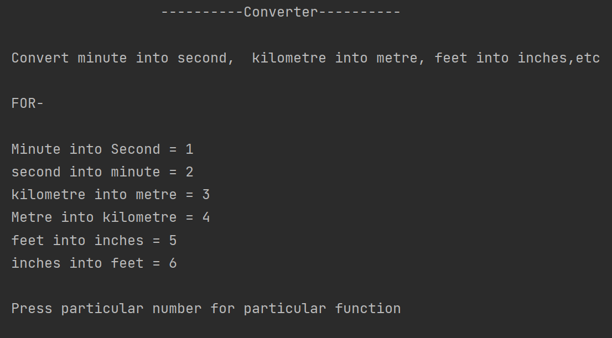
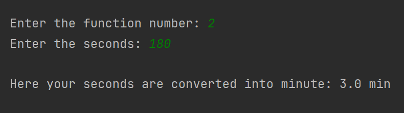
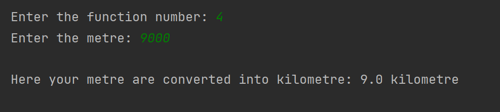

# Converter
<hr>

### This program is made by me to make easy to you in subjects like science-1 and maths, by solving the problems in science-1 and maths you may have arise difficulties to convert Minutes into second , second into minute or Kilometre into metre , metre into kilometre or feets into inches , inches into feets, etc

### Don't worry this program will fix your problem



## Minute into seconds

while converting into minute into seconds

```multiply the time value by 60```

program output:


## Seconds into minute
while converting into seconds into minute

```divide the time value by 60```

program output:



## Kilometre into metre
while converting into kilometre into metre

```multiply the length value by 1000```

program output:


## Metre into kilometre

while converting metre into kilometre

```divide the length value by 1000```

program output:



## Feet into inches
while converting into feets into inches

```multiply the length value by 12```

program output:


## Inches into feets
while converting into inches into feets

```divide the length value by 12```


If you want more function in this program 

email me : tanmayrmohite@gmail.com

